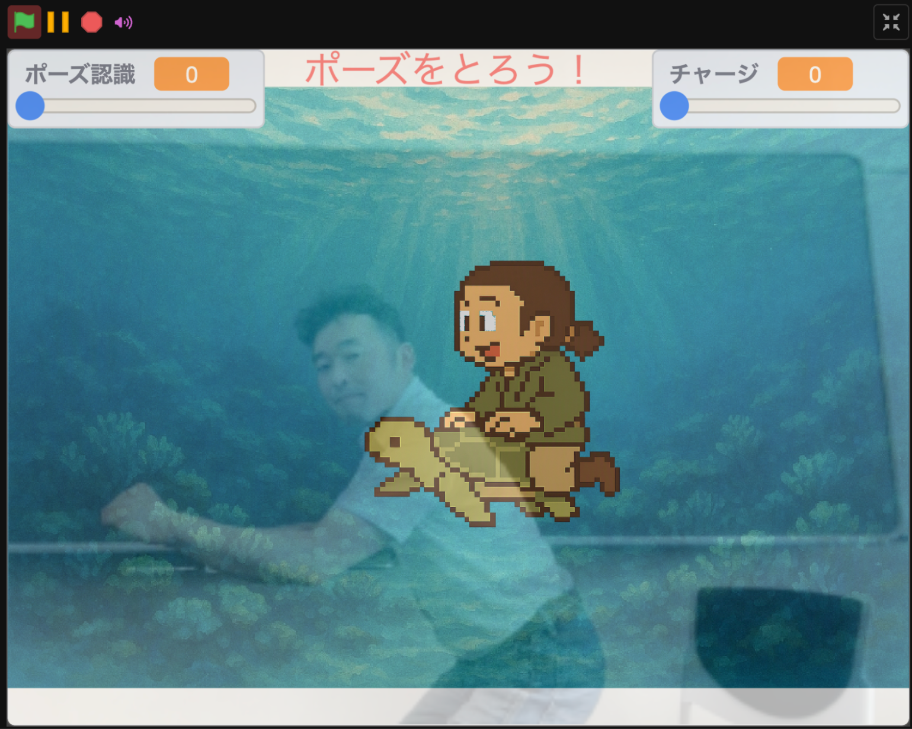

# TM紙芝居

[English](README.md) | 日本語

**ポーズで物語に参加する、AIインタラクティブ紙芝居**

TM紙芝居は、カメラの前で取ったポーズをきっかけに、登場人物、背景、音声、セリフ、分岐を進める参加型の紙芝居システムです。ポーズ認識にはTM、作品の編集と実行にはTurboWarpを使い、台本とアセットからWeb／SB3形式の作品を作れます。

このリポジトリでは、紙芝居ランタイム、DSL、CLI／JavaScript API、配布用SB3、公開サイトを開発しています。操作方法、作者ガイド、コマンドリファレンス、トラブルシューティング、移行ノートの正本は[ドキュメントサイト](https://kubohiroya.github.io/tm-kamishibai-docs/)です。



[公式サイト](https://kubohiroya.github.io/tm-kamishibai/) · [Web版を体験する](https://sqs.prof.cuc.ac.jp/kamishibai/) · [SB3をダウンロードする](https://kubohiroya.github.io/tm-kamishibai/downloads/) · [作り方を読む](https://kubohiroya.github.io/tm-kamishibai-docs/) · [サンプルを見る](https://kubohiroya.github.io/tm-kamishibai-samples/)

## このプロジェクトでできること

- 参加者のポーズ、キー入力、画面タッチで物語を進める
- YAMLまたは3.1／3.2テキストDSLで、シーン、分岐、セリフ、動き、音声、ポーズ認識を記述する
- TurboWarp上で台本をプレビューし、配布できる自己完結SB3を作る
- CLIで検証、live preview、SB3生成、旧DSL変換、アセット配布を自動化する
- DSL 4.0のcore actionをTurboWarpブロックまたはJavaScript APIから呼び出す

## どの版を使うか

|                      | 3.2.3                                | 4.0.0-rc.11                                  |
| -------------------- | ------------------------------------ | -------------------------------------------- |
| 状態                 | 安定版・現在の推奨                   | リリース候補                                 |
| 向いている用途       | 体験会、安定運用、既存の3.1／3.2作品 | YAML台本、ブラウザ制作、CLI／APIの先行検証   |
| 台本                 | 3.1／3.2テキストDSL                  | DSL 4.0 YAML                                 |
| 入手先               | [ダウンロードページ][downloads]      | [ダウンロードページ][downloads]／npmの`next` |
| 変更時に確認する文書 | [公開ドキュメント][docs]             | [4.0リリースノート][rc11]                    |

迷った場合は3.2.3を使ってください。4.0.0-rc.11は正式版前の公開候補であり、安定運用よりも4.0の制作フローやAPIを検証したい場合に適しています。公開済みの3.1／3.2作品は、4.0へ移行しなくても引き続き利用できます。

## まず体験する

ブラウザですぐ試す場合は、[公開中のWeb版](https://sqs.prof.cuc.ac.jp/kamishibai/)または[「浦島太郎」のサンプル](https://kubohiroya.github.io/tm-kamishibai-samples/stories/urashima/web/)を開きます。カメラの利用を許可し、画面の案内に従ってポーズを取ってください。

作品ファイルをTurboWarpで開く場合は、[ダウンロードページ][downloads]から使用する系列のSB3を取得します。体験会で使う資料は[ワークショップ一覧](https://kubohiroya.github.io/tm-kamishibai-docs/workshops/)から選べます。

## 制作を始める

### 安定した体験会には3.2を使う

イベントや既存の3.1／3.2作品には3.2.3を使います。3.2 SB3をダウンロードして[TurboWarp Editor](https://turbowarp.org/editor)で開き、従来のテキストDSLと体験会の流れは[公開ドキュメント][docs]に従ってください。

### YAML projectには4.0を使う

YAML authoring、browser live preview、現行CLI／APIを評価する場合は4.0.0-rc.11を使います。Standard SB3は`.k4.yml`台本ファイルまたはproject directoryを開き、変更の検証、live preview、配布用SB3の生成まで行えます。

```yaml
kamishibai: '4.0'

controls:
  keymaps:
    production:
      Space: navigation.nextAction

scenes:
  opening:
    - wait: 1
    - goto: ending
  ending: []
```

より実用的な台本、アセット参照、ポーズモデル、分岐、吹き出し、ブラウザ条件、トラブルシューティングについては[DSL 4.0作者ガイド](https://kubohiroya.github.io/tm-kamishibai-docs/dsl-author-guides/dsl-4.0-author-guide/)と[サンプルリポジトリ](https://github.com/kubohiroya/tm-kamishibai-samples)を参照してください。

## CLI quick start

[`@kubohiroya/tm-kamishibai`](https://www.npmjs.com/package/@kubohiroya/tm-kamishibai/v/4.0.0-rc.11)のCLIは、CI、再現可能なbuild、大規模project、配布profileの管理に向いています。Node.js 22.12.0以上とpnpm 11を使用し、検証するversionを固定して導入します。

```bash
pnpm add --save-exact @kubohiroya/tm-kamishibai@4.0.0-rc.11
pnpm exec tm-kamishibai --help
pnpm exec tm-kamishibai validate-dsl4 --input opening.k4.yml --format pretty
pnpm exec tm-kamishibai preview-dsl4 --watch --base kamishibai-4-base.sb3 --project-root .
pnpm exec tm-kamishibai build-dsl4 --base kamishibai-4-base.sb3 --project-root . --output dist/my-story.sb3
pnpm exec tm-kamishibai convert-dsl4 --input legacy-story.txt --output opening.k4.yml
```

完全なコマンドリファレンス、終了status、release workflowは[メンテナンスガイド](https://kubohiroya.github.io/tm-kamishibai-docs/developer-guides/developer-guide/)を参照してください。

## 仕組み

```text
YAML + assets
    ↓
source frontend (parse, schema, semantic validation)
    ↓
browser preview / CLI build
    ↓
self-contained SB3
    ↓
TurboWarp runtime + TM
```

preview、validator、builder、runtime loaderは同じStoryDocumentと診断を使います。local assetは作品SB3へ埋め込み、remote assetはintegrityと配布profileを明示します。build失敗時は既存成果物を保持し、検証済みcandidateだけを置き換えます。

実装の詳細はリポジトリ内の設計文書にあります。

- [DSL 4.0表層仕様](https://github.com/kubohiroya/tm-kamishibai/blob/main/docs/design/dsl-4-surface.md): YAML契約、action surface、resource limit、model initialization、pose overlay
- [DSL 4.0 processing architecture](https://github.com/kubohiroya/tm-kamishibai/blob/main/docs/design/dsl-4-processing-architecture.md): source frontend、StoryDocument、runtime境界、診断
- [Asset distribution profiles](https://github.com/kubohiroya/tm-kamishibai/blob/main/docs/design/dsl-4-asset-distribution-profiles.md): local、remote、embedded、offline assetの挙動
- [Capability bundle and release contract](https://github.com/kubohiroya/tm-kamishibai/blob/main/docs/design/dsl-4-capability-bundle-release.md): 固定extension package、embedded ID、artifact provenance、rollback policy
- [DSL 3.1/3.2 to 4.0 migration](https://github.com/kubohiroya/tm-kamishibai/blob/main/docs/design/dsl-4-migration.md): 変換分類、warning、legacy artifact policy

現行4.0 candidateは`@kubohiroya/turbowarp-tm@2.0.0`と`kubohiroyatm` embedded TM extension IDを使います。旧package名、CLI名、URL、SB3 IDは過去releaseとmigration noteにだけ残します。

## このリポジトリを開発する

必要な環境:

- Node.js 22.12.0以上
- pnpm 11
- SB3やブラウザ統合を変更する場合は、TurboWarpを実行できるdesktop環境

セットアップ:

```bash
pnpm install --frozen-lockfile
pnpm verify:quick
```

主な検証:

| Command             | Purpose                                                             |
| ------------------- | ------------------------------------------------------------------- |
| `pnpm verify:quick` | Lint, type-check, and run the lightweight tests during development  |
| `pnpm verify:full`  | Run the CI-equivalent SB3, full test, E2E, site, and package checks |
| `pnpm format`       | Check formatting with Prettier                                      |
| `pnpm test`         | Run the full unit and integration suite                             |
| `pnpm run build`    | Build the site and fetch verified Release SB3 assets into `dist/`   |
| `pnpm sb3:check`    | Regenerate and verify the current DSL 4.0 release candidate         |
| `pnpm pack:smoke`   | Verify the installable npm package contents                         |

`scripts/site-navigation.mjs`は生成物です。
[tm-kamishibai-docs](https://github.com/kubohiroya/tm-kamishibai-docs)と
[tm-kamishibai-samples](https://github.com/kubohiroya/tm-kamishibai-samples)の同名ファイルと
バイト単位で一致させる契約で、`Navigation contract` workflowが正本のdocs側と比較します。
このリポジトリでは編集しないでください。正本はtm-kamishibai-samplesの
`scripts/site-navigation.ts`です。変更するときはそちらを編集し、
`pnpm build:site-navigation`で再生成して3リポジトリへ配布します。

## ドキュメント

- [公開ドキュメント](https://kubohiroya.github.io/tm-kamishibai-docs/): 操作、作者ガイド、コマンドリファレンス、トラブルシューティング、移行ノート、ワークショップ資料
- [ドキュメントsource](https://github.com/kubohiroya/tm-kamishibai-docs): 公開文書の原稿とissue
- [v4.0.0-rc.11リリースノート][rc11]: 公開状態、互換性、検証済みartifact、rollback
- [Issue tracker](https://github.com/kubohiroya/tm-kamishibai/issues): bug、提案、実装scope、受け入れ基準、rollback plan

## 関連プロジェクト

- [`kubohiroya/tm-kamishibai-samples`](https://github.com/kubohiroya/tm-kamishibai-samples): サンプル台本、画像、音声、SB3、Web作品
- [`kubohiroya/tm-kamishibai-docs`](https://github.com/kubohiroya/tm-kamishibai-docs): 利用者、作者、開発者、体験会向け文書
- [`kubohiroya/sb3-toolchain`](https://github.com/kubohiroya/sb3-toolchain): SB3の展開、検証、再構築、埋め込み拡張管理
- [`kubohiroya/turbowarp-tm`](https://github.com/kubohiroya/turbowarp-tm): TurboWarp向けポーズ認識拡張

## ライセンス

個別表示のない、本プロジェクトが著作権を持つソフトウェアと素材にはMPL-2.0を適用します。第三者著作物と素材ごとの条件は[`LICENSES.md`](LICENSES.md)を参照してください。ドキュメントとサンプルには、それぞれのリポジトリで示す条件が適用されます。

[docs]: https://kubohiroya.github.io/tm-kamishibai-docs/
[downloads]: https://kubohiroya.github.io/tm-kamishibai/downloads/
[rc11]: https://github.com/kubohiroya/tm-kamishibai/blob/main/docs/releases/v4.0.0-rc.11.md
