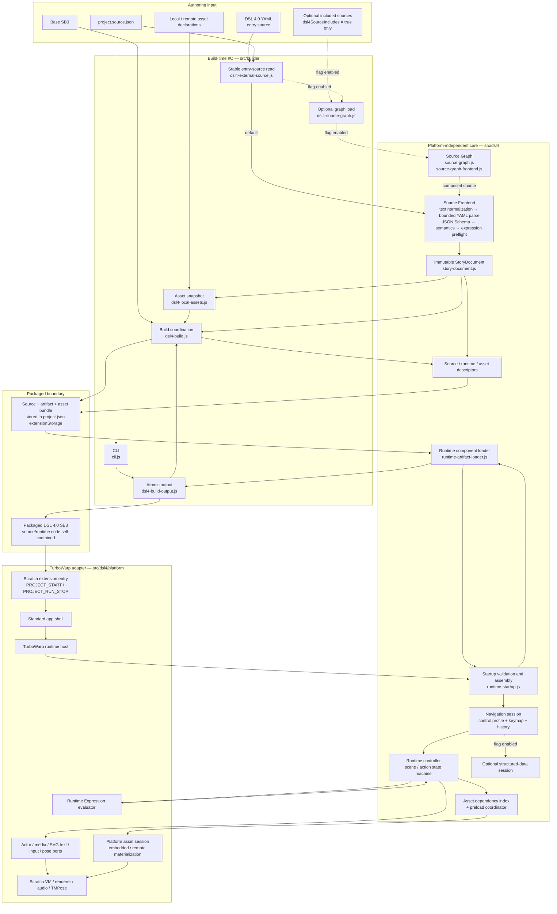
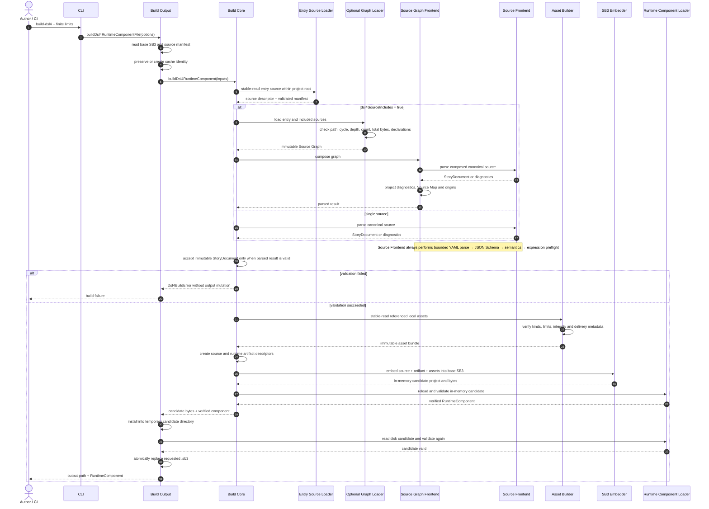
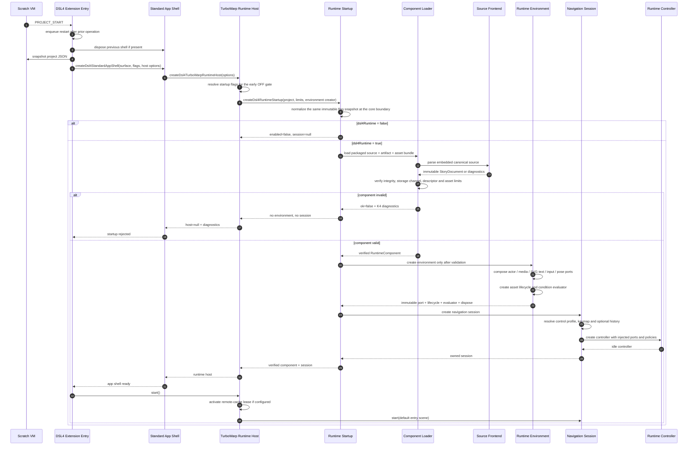
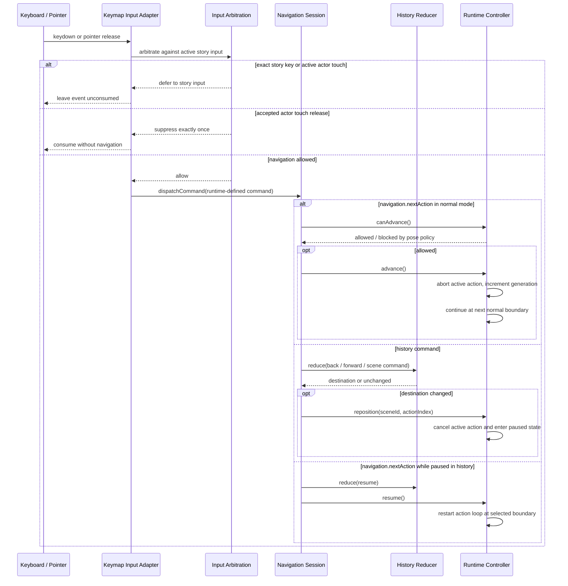

# DSL 4.0処理系のモジュール構成と実行シーケンス

Copyright © 2026 Hiroya Kubo.

文書状態: 現行実装の技術解説

対象: DSL 4.0 runtime／builder／platform adapterの実装者、reviewer

調査基準日: 2026-08-08

関連仕様:
[`dsl-4-design.md`](dsl-4-design.md)、
[`dsl-4-surface.md`](dsl-4-surface.md)、
[`dsl-4-action-registry.md`](dsl-4-action-registry.md)、
[`dsl-4-input-arbitration.md`](dsl-4-input-arbitration.md)、
[`schema/dsl-4.schema.json`](../../schema/dsl-4.schema.json)

## 0. 用語と読み分け

この文書では、同じ処理段階に見えても所有者や信頼境界が異なるobjectを別の用語で表します。
特に`source`、`artifact`、`runtime`を冠する語は同義語ではありません。

バッククォートで囲んだ名前は、source code上の型、property、method、event、flag等の識別子です。
それ以外の英語は、実装で使う概念名を日本語訳だけで曖昧にしないために併記しています。

### 0.1 共通概念

| 用語                                     | この文書での意味                                                                                                                                                                                             |
| ---------------------------------------- | ------------------------------------------------------------------------------------------------------------------------------------------------------------------------------------------------------------ |
| 正規化                                   | 同じ意味を持ち得る複数の入力表現を、後段が一種類だけ処理すればよい一定の形式へ変換すること。source textの正規化と実行用データ構造の正規化は別工程                                                            |
| immutable（作成後変更不可）              | 作成後にproperty、配列要素、入れ子objectを変更できない状態。この実装では`deepFreeze`した値を指し、更新時は既存値を書き換えず新しい値を作る                                                                   |
| pure（platform非依存）                   | Node.js、DOM、Scratch VM、network、filesystemへ直接アクセスせず、入力objectも変更しない処理。必要な外部操作はportまたはcallbackとして受け取る                                                                |
| integrity                                | 対象byte列が変更されていないことを検証するSHA-256 SRI（Subresource Integrity）文字列。`sha256-`とBase64 digestからなる                                                                                       |
| SB3                                      | Scratch 3 project file。実体は`project.json`とcostume／sound等のasset fileを格納したZIP archive                                                                                                              |
| Scratch project JSON                     | SB3内の`project.json`。target、block、variable、costume、sound、extension情報等、Scratch projectの構造を表すJSON                                                                                             |
| 拡張データ保存領域（`extensionStorage`） | Scratch project JSONのtop-levelにあるobject。各拡張が自身の拡張IDをkeyとしてJSONデータを保存し、そのobjectは`project.json`の一部としてSB3へ格納される。browserのLocal Storage、IndexedDB、filesystemではない |
| descriptor（記述子）                     | sourceや設定の実体について、format version、識別子、byte長、integrity等をJSONで記述し、保存後に内容を再検証できるようにするmetadata object                                                                   |
| packaging                                | 検証済みsource、設定、assetを記述子、manifest、payloadとして`project.json`とSB3へ格納する工程                                                                                                                |
| current／candidate／commit               | currentは現在公開中の状態、candidateは検証・準備中で未公開の状態、commitはcandidateをcurrentとして一度だけ公開する境界                                                                                       |
| resource                                 | listener、timer、camera、VM、audio、renderer、model、cache lease等、使用終了時に明示的な解放を必要とするもの                                                                                                 |
| owner／lifetime                          | ownerはresourceを生成して解放責任を持つobject、lifetimeはそのownerがresourceを保持してよい開始から解放までの期間                                                                                             |
| snapshot                                 | ある時点の値を防御的にcopyして固定したもの。元objectが後から変更されてもsnapshotは変化しない                                                                                                                 |
| stable read                              | fileの状態と内容を複数回確認し、読込中に置換・更新されていない一つのsnapshotだけを採用する読込                                                                                                               |
| bounded／finite                          | byte数、件数、深さ、診断数、待機時間等に明示的な上限があり、入力に比例して無制限にmemoryや時間を消費しないこと                                                                                               |
| atomic replacement                       | 完成・検証済みの一時candidateをrenameし、最終出力fileに部分内容を見せず一回で置換すること。この文書ではSB3一件の置換を指す                                                                                   |
| payload                                  | command、event、descriptor等が運ぶ具体的なデータ部分                                                                                                                                                         |
| state machine                            | 許可されたstatusとstatus遷移を定義し、同時に複数の矛盾した状態を公開しない制御方式                                                                                                                           |
| surface                                  | 作者またはplatformから見える操作・表示境界。例はScratch extension entry、app shell、preview UI                                                                                                               |
| channel                                  | 同じruntime componentをSB3へ格納する位置の区別。`unbundled`はruntime拡張ID直下、`bundled`は複数componentをまとめる拡張の`components`配下へ格納する                                                           |
| control profile／keymap                  | control profileは作品の操作方式を選ぶ名前、keymapは物理keyやpointer入力を`navigation.nextAction`等のruntime定義済みcommand名へ対応付けた表                                                                   |
| history                                  | scene／actionの移動履歴と、back／forward／resumeで参照する位置state。台本sourceやpackaged SB3へ操作中の履歴を保存する意味ではない                                                                            |

`extensionStorage`は概念的には次の位置です。実際の`bundled` channelでは、複数componentをまとめる
拡張の`components`配下へruntime componentを一段深く格納します。

```json
{
  "extensionStorage": {
    "kubohiroyakamishibairuntime4": {
      "source": {},
      "artifact": {},
      "assets": {}
    }
  }
}
```

### 0.2 sourceとSB3格納

| 用語                           | この文書での意味                                                                                                                                                                             |
| ------------------------------ | -------------------------------------------------------------------------------------------------------------------------------------------------------------------------------------------- |
| entry source                   | `project.source.json`が指す、projectの入口となる1個のDSL 4.0 YAML。許可suffixとpath規則はsource loader契約を正本とする                                                                       |
| included source                | entry sourceの`include`から到達する任意source。`dsl4SourceIncludes`が起動時に有効な場合だけ読み、default経路では存在しない                                                                   |
| source manifest                | entry sourceのmode、source ID、project-relative path、cache identityを宣言する`project.source.json`                                                                                          |
| `sourceId`                     | 診断とsource descriptorでsourceを識別する論理ID。作者machine上の絶対pathやURLを使わない                                                                                                      |
| cache identity                 | verified remote asset cacheを台本単位で分離するstable story ID、表示名、IndexedDB database名の組。source本文のintegrityとは別物                                                              |
| canonical source               | UTF-8 BOMを除去し、CRLF／CRをLFへ揃えたsource text。byte長、integrity、YAML診断位置の基準になる                                                                                              |
| composed source                | Source Graphが複数sourceの宣言を決定的順序で統合して生成する単一のcanonical YAML。include directiveそのものは含めない                                                                        |
| Source Graph                   | entry／included source、include edge、宣言元を持つ作成後変更不可のgraph。filesystem探索を行うbuilder側graph loaderとは区別する                                                               |
| Source Graph Frontend          | Source Graphをcomposed sourceへ変換し、production Source Frontendを呼び、診断とsource位置を宣言元sourceへ投影する、flag有効時だけの追加処理層                                                |
| Source Frontend                | canonical sourceを上限付きYAML parse、JSON Schema、意味、resource上限、式の事前検査の順で検証し、成功時だけ`StoryDocument`を返すpureな検証境界                                               |
| production Source Frontend     | pure Source Frontendへ固定Runtime Expression評価器を注入し、buildとruntimeで同じ式文法を検証する共通処理入口                                                                                 |
| 上限付きYAML parse             | YAMLをobjectへ変換しつつ、文書数、node数、深さ、alias、tag、重複key等の許可範囲を検査する段階                                                                                                |
| JSON Schema検証                | key名、必須field、型、列挙値、object／array形状がDSL 4.0 schemaに一致するかを検査する段階                                                                                                    |
| semantic検証                   | schemaだけでは判定できないID参照、scene遷移先、asset種別、action引数間の意味的整合性を検査する段階                                                                                           |
| 式の事前検査（preflight）      | 条件式を実行せずにparseし、許可された文法、演算、参照、resource上限に収まることをbuild／startup時に確認する段階                                                                              |
| `StoryDocument`                | YAMLを検証・変換して得る、runtimeが直接実行する中間表現（IR: Intermediate Representation）。sceneを記述順の配列、actionをcommandと型付き引数に揃え、source位置を保持して作成後変更不可にする |
| `storyPath`                    | `StoryDocument`内のscene、action、引数等を指す安定した論理path。sourceの行番号やfilesystem pathではない                                                                                      |
| source range                   | source text内の開始／終了line、column、UTF-16 offsetを表す位置情報                                                                                                                           |
| Source Map                     | `storyPath`からsource rangeへの対応表。JavaScript bundleのsource mapとは別物                                                                                                                 |
| `sourceOrigins`                | Source Graph使用時に、`storyPath`ごとの宣言元`sourceId`とsource rangeを保持する対応表。version、件数、path、source ID、rangeを検証する記述子としてpackaged sourceに保存する                  |
| Base SB3                       | DSL 4.0 runtime componentを埋め込む前の、土台となるScratch project file                                                                                                                      |
| packaged SB3                   | source descriptor、runtime artifact、asset bundleを`project.json`の拡張データ保存領域へ格納した配布／実行候補                                                                                |
| source／runtime self-contained | sourceとruntime codeが外部file／remote codeなしで起動できること。asset bytesはembedded、または明示的なverified remote deliveryの別policyに従う                                               |

### 0.3 SB3格納情報とruntime object

| 用語                     | この文書での意味                                                                                                                                  |
| ------------------------ | ------------------------------------------------------------------------------------------------------------------------------------------------- |
| runtime component        | 一つのDSL 4.0実行単位として対応付けられたsource descriptor、runtime artifact、asset bundleの組                                                    |
| source descriptor        | SB3へ格納するsource text、media type、byte長、integrity、source IDと、include使用時の上限付き`sourceOrigins`をまとめたJSON形式の検証用記述子      |
| runtime artifact         | source integrity、control profile、解決済みkeymap、history設定をまとめた、JSON形式の検証用記述子。実行sessionそのものではない                     |
| asset bundle             | asset metadata、delivery、integrityを持つmanifestと、SB3へ埋め込むasset byte列の組。remote assetでは検証に必要なmetadataだけを保持する            |
| Runtime Component Loader | `project.json`から三つの格納情報を読み、sourceを再parseし、相互のintegrity、channel、上限を再検証するpure処理。成功時だけ`RuntimeComponent`を返す |
| `RuntimeComponent`       | packaged source、runtime artifact、asset bundleを共有loaderで再検証した成功結果。まだVM、camera、rendererを所有しない                             |
| extension entry          | `PROJECT_START`／`PROJECT_RUN_STOP`を受け、app shellの再生成と破棄を一件ずつ順番に処理するScratch lifecycle入口                                   |
| app shell                | title／loading／error／pose feedback等の表示surfaceとruntime hostのlifetimeを所有するplatform object                                              |
| runtime host             | actor、media、input、pose等のTurboWarp機能実装をまとめ、runtime environmentを作るplatform adapter                                                 |
| runtime startup          | feature flagとpackaged componentを検証し、成功後だけenvironmentとnavigation sessionを生成するcore側の起動順序制御                                 |
| runtime environment      | actor、media、input、pose、asset、式評価のportと、それらを一括解放する`dispose()`を持つplatform resource owner                                    |
| navigation session       | control profile、keymap、history、reposition／resumeとruntime controllerのlifetimeを所有する一回の実行単位                                        |
| runtime controller       | scene／actionの実行位置、variable、cancel、failure、finishを一件ずつ処理するplatform非依存state machine                                           |
| port                     | controllerがplatform操作を呼ぶための関数群。coreはTurboWarp、DOM、cameraの具体APIを知らない                                                       |
| adapter                  | TurboWarp／DOM等の具体APIをportの関数群へ変換する実装                                                                                             |
| composition              | 複数adapterや機能実装を一つのport／environmentへ組み立てる関数                                                                                    |

### 0.4 lifecycle、診断、optional機能

| 用語                        | この文書での意味                                                                                                     |
| --------------------------- | -------------------------------------------------------------------------------------------------------------------- |
| prepare                     | 必要なassetを特定して検証・読込を開始し、遷移先をまだ公開せず使用可能になるまで待つ段階                              |
| materialize                 | 検証済みbyte列をrenderer image、audio buffer、PoseNet model等のplatform resourceへ変換する処理                       |
| commit                      | 準備済みcandidateをcurrent scene／actionとして公開する境界。prepareだけでは表示中stateを変更しない                   |
| release                     | scene遷移やstop時に、不要になった個別asset resourceの参照とplatform resourceを解放する処理                           |
| asset lifecycle             | assetのprepare、materialize、commit、retention、release、cache leaseを通した一連の状態と所有権管理                   |
| retention                   | materialize済みasset resourceをscene終了まで、またはstory終了まで保持する方針                                        |
| lease                       | verified remote cache等を特定ownerが使用中であることを示す期限付き所有権                                             |
| dispose                     | ownerが保持するresourceを、途中の解放失敗があっても残りを継続しながら一度だけ解放する終了操作                        |
| scope                       | story、scene、action等の有効範囲。scope終了時にその範囲専用のvariableやresourceを解放する                            |
| embedded asset              | asset byte列をSB3内へ格納し、実行時にnetworkを使わずmaterializeするdelivery                                          |
| remote pose asset           | TMPose directory URLを正本として、必要時に現在のmodel filesを取得するdelivery                                        |
| verified remote asset       | 台本がHTTPS URL、期待SHA-256 integrity、media type、sizeを明示し、取得後のbyte列を再検証してから使用するdelivery     |
| asset dependency index      | story開始時または各sceneで必要になるasset IDを、`StoryDocument`から事前計算した対応表                                |
| Asset Preload Coordinator   | dependency indexに従って遷移先assetのprepareを開始し、成功時のcommitと不要resourceのreleaseを調整するcore object     |
| Platform Asset Session      | embedded／remote byte列をplatform resourceへmaterializeし、retention、cache lease、disposeを所有するadapter          |
| condition evaluator         | 事前検査済みの条件式を現在のvariableとaction contextに対して評価し、branchのtrue／falseを返す関数                    |
| `ActionContext`             | actionのgeneration、variable view、source位置、cancel signal等をportへ渡す実行context                                |
| `AbortSignal`               | 実行中operationへcancelを通知する標準signal。通知後に返った結果はgeneration検査も通過しなければcommitできない        |
| generation                  | action／reposition／cancelごとに増加し、古い非同期結果を識別するcontroller内counter                                  |
| runId                       | action loop全体の再起動単位を識別し、旧loopが新loopへ状態を公開することを防ぐcounter                                 |
| K4 diagnostic               | `code`、severity、message、`sourceId`、`storyPath`、source rangeを持つ作者向けの有限診断                             |
| startup-fixed feature flag  | startup時に一度だけ解決し、同じsession中に変更しないflag。optional経路をdefault runtime graphから分離する            |
| Structured Data integration | story／scene／action iteratorとaction scope resourceをruntime eventへ同期するoptional session                        |
| custom action composition   | Scratch hatから作ったregistryとhandler threadをoptional portへ接続するcomposition。default runtime graphには含めない |

## 1. 文書の範囲

この文書は、DSL 4.0の台本を検証してsource／runtime codeが自己完結したpackaged SB3へ格納するbuild経路と、TurboWarp上で
SB3を再検証してからシナリオを実行するruntime経路を、現行source codeに対応付けて説明します。
Web Preview、source／asset live reload、reload overlayの内部protocolは対象外とし、
それぞれの専用設計文書を正本とします。

台本ファイル名のsuffixやmanifest pathの許可範囲はsource loaderの境界契約です。
この文書ではそれを重複定義せず、図中では「DSL 4.0 YAML」と表記します。source frontend以降は
canonical sourceまたはimmutableな`StoryDocument`を受け取るため、ファイル名には依存しません。

処理系の主要な不変条件は次のとおりです。

- source frontendは、上限付きYAML parse、JSON Schema検証、semantic検証、式の事前検査に成功するまで
  `StoryDocument`を公開しない。
- `StoryDocument`、runtime artifact、asset bundle、feature flag snapshotはimmutableにする。
- `src/dsl4/`のcoreはNode.js、DOM、Scratch VM、network、filesystemへ直接依存しない。
- platform固有処理はruntime portとasset lifecycleとして注入する。
- packaged source、artifact、asset bundleは、build出力時とruntime起動時に再検証する。
- scene遷移は遷移先のasset準備後にcommitし、準備失敗時は遷移先を公開せずfailed stateへ収束する。
- action実行は一つずつ直列化し、cancel後に古い非同期結果をcommitしない。

## 2. モジュール構成

### 2.1 全体構成



実線の`SOURCEIO → FRONTEND`がdefaultの単一source経路です。破線のSource Graph経路は
`dsl4SourceIncludes`が起動時に有効な場合だけentry／included sourceを合成し、その結果を同じproduction
Source Frontendへ渡します。図の中央にある`StoryDocument`が、source表層構文とruntime実行の境界です。runtimeはYAML nodeを
直接参照せず、sceneを記述順のarray、actionを型付き引数、source位置をSource Mapとして持つ
正規化済み文書だけを実行します。

### 2.2 モジュール責務

| レイヤー                 | 主なmodule                                                                                                                                                                                                                                                                                                                                                                          | 責務                                                                                                                                                         |
| ------------------------ | ----------------------------------------------------------------------------------------------------------------------------------------------------------------------------------------------------------------------------------------------------------------------------------------------------------------------------------------------------------------------------------- | ------------------------------------------------------------------------------------------------------------------------------------------------------------ |
| CLI／出力                | [`bin/tmpose-kamishibai.mjs`](../../bin/tmpose-kamishibai.mjs)、[`src/builder/cli.js`](../../src/builder/cli.js)、[`dsl4-build-output.js`](../../src/builder/dsl4-build-output.js)                                                                                                                                                                                                  | optionと有限上限を受け取り、入力を読み、候補SB3を再検証してatomicに置換する                                                                                  |
| source I/O               | [`dsl4-external-source.js`](../../src/builder/dsl4-external-source.js)                                                                                                                                                                                                                                                                                                              | entry sourceについてproject root、regular file、symlink、安定読込、byte上限を検査し、machine-local absolute pathをcoreへ漏らさない                           |
| optional graph I/O       | [`dsl4-source-graph.js`](../../src/builder/dsl4-source-graph.js)                                                                                                                                                                                                                                                                                                                    | flag有効時だけincluded sourceを探索し、個別／総byte、file数、depth、project-root confinementを検査してpure Source Graphを作る                                |
| Source Graph             | [`source-graph.js`](../../src/dsl4/source-graph.js)、[`source-graph-frontend.js`](../../src/dsl4/source-graph-frontend.js)                                                                                                                                                                                                                                                          | immutable graphのcycle／宣言整合性を検査してcomposed sourceを作り、診断とsource位置を元sourceへ投影する。`dsl4SourceIncludes`が有効な場合だけ使用する        |
| source frontend          | [`source-frontend.js`](../../src/dsl4/source-frontend.js)、[`semantic-validator.js`](../../src/dsl4/semantic-validator.js)、[`story-document.js`](../../src/dsl4/story-document.js)                                                                                                                                                                                                 | text正規化、上限付きYAML parse、JSON Schema、semantic／resource／式の事前検査を行い、Source Map付き`StoryDocument`を生成する                                 |
| production frontend      | [`dsl4-source-frontend.js`](../../src/builder/dsl4-source-frontend.js)                                                                                                                                                                                                                                                                                                              | pure frontendへ固定Runtime Expression compositionを注入し、buildとruntimeで同じ式文法を使う                                                                  |
| build core               | [`dsl4-build.js`](../../src/builder/dsl4-build.js)                                                                                                                                                                                                                                                                                                                                  | source、asset snapshot、descriptorをまとめ、SB3へ格納し、memory上の生成物を共有loaderで再検証する                                                            |
| artifact境界             | [`source-descriptor.js`](../../src/dsl4/source-descriptor.js)、[`source-origin-descriptor.js`](../../src/dsl4/source-origin-descriptor.js)、[`runtime-artifact-descriptor.js`](../../src/dsl4/runtime-artifact-descriptor.js)、[`asset-bundle-descriptor.js`](../../src/dsl4/asset-bundle-descriptor.js)、[`runtime-artifact-loader.js`](../../src/dsl4/runtime-artifact-loader.js) | source integrity、source origin、channel、control profile、asset metadata／byte列の整合性を検証する                                                          |
| extension entry          | [`dsl4-runtime-extension-entry.js`](../../scripts/sb3/dsl4-runtime-extension-entry.js)                                                                                                                                                                                                                                                                                              | Scratch lifecycle eventを直列化し、project開始時にapp shellを再生成、停止時に所有resourceをdisposeする                                                       |
| app shell                | [`standard-app-shell.js`](../../src/dsl4/platform/standard-app-shell.js)                                                                                                                                                                                                                                                                                                            | title／loading／error等の共通表示と任意のpose状態表示を所有し、runtime hostの寿命を管理する                                                                  |
| runtime host             | [`turbowarp-runtime-host.js`](../../src/dsl4/platform/turbowarp-runtime-host.js)                                                                                                                                                                                                                                                                                                    | actor、media、SVG Text、input、pose、asset、式評価を一つのruntime environmentへ合成し、coreへportを注入する                                                  |
| startup                  | [`runtime-startup.js`](../../src/dsl4/runtime-startup.js)                                                                                                                                                                                                                                                                                                                           | 起動時固定flagを解決し、packaged component検証後にenvironmentとnavigation sessionを生成する                                                                  |
| navigation               | [`navigation-session.js`](../../src/dsl4/navigation-session.js)、[`control-profile-resolver.js`](../../src/dsl4/control-profile-resolver.js)、[`keymap-input-adapter.js`](../../src/dsl4/keymap-input-adapter.js)、[`input-arbitration.js`](../../src/dsl4/input-arbitration.js)、[`history-reducer.js`](../../src/dsl4/history-reducer.js)                                         | control profile、入力arbitration、履歴、reposition／resumeをruntime controllerへ接続する                                                                     |
| execution core           | [`runtime-controller.js`](../../src/dsl4/runtime-controller.js)                                                                                                                                                                                                                                                                                                                     | scene entry、action dispatch、branch、cancel、failure、finishを一件ずつ処理するstate machineとして実行する                                                   |
| asset実行                | [`asset-dependency-index.js`](../../src/dsl4/asset-dependency-index.js)、[`asset-preload-coordinator.js`](../../src/dsl4/asset-preload-coordinator.js)、[`platform-asset-session.js`](../../src/dsl4/platform/platform-asset-session.js)                                                                                                                                            | startup／sceneごとの依存を算出し、materialize、loading表示、commit、scene retentionとreleaseを調整する                                                       |
| optional structured data | [`kamishibai-structured-data.js`](../../src/dsl4/kamishibai-structured-data.js)                                                                                                                                                                                                                                                                                                     | story／scene／action iteratorとaction scope resourceの寿命をruntime event境界へ同期する                                                                      |
| optional custom action   | [`action-registry.js`](../../src/dsl4/action-registry.js)、[`action-hat-detector.js`](../../src/dsl4/action-hat-detector.js)、[`action-invocation-adapter.js`](../../src/dsl4/action-invocation-adapter.js)、[`action-context-turbowarp.js`](../../src/dsl4/action-context-turbowarp.js)                                                                                            | Scratch hatからimmutable registryを作り、custom action threadとActionContextを接続する。default runtime graphからは分離され、明示的なcompositionが必要である |

## 3. Buildからpackaged SB3まで



build core自体はdiskを書き換えません。SB3出力mutationは`dsl4-build-output.js`へ隔離され、候補byte列が
変化していないことと、diskから読み直したSB3が共有loaderを通ることを確認した後だけ既存出力を
置換します。新規cache identityを`project.source.json`へ保存する操作はSB3置換transactionとは別であり、
両fileを一つのatomic transactionとして扱うものではありません。

## 4. Runtime初期化シーケンス



重要なのは、TurboWarp actor adapterやasset managerなど副作用を持つenvironmentを、packaged componentの
検証より前に生成しないことです。途中でenvironmentまたはsession生成に失敗した場合は、作成済みresourceを
同じownerがdisposeしてから失敗を返します。

## 5. シナリオ実行シーケンス

```mermaid
sequenceDiagram
  autonumber
  participant Session as Navigation Session
  participant Controller as Runtime Controller
  participant Preload as Asset Preload Coordinator
  participant Lifecycle as Asset Lifecycle
  participant Expr as Condition Evaluator
  participant Structured as Optional Structured Data
  participant Port as Runtime Port
  participant Platform as TurboWarp / TMPose / UI

  Session->>Controller: start(sceneId?, actionIndex?, variables?)
  Controller->>Controller: reset generation, trace, variables and failure state
  Controller->>Controller: emit runtime.start
  opt structuredDataIntegrationEnabled
    Controller->>Structured: begin story iterator and scopes
  end

  Controller->>Preload: prepareStartup(generation)
  Preload->>Lifecycle: prepare(startup asset IDs, AbortSignal)
  Lifecycle->>Platform: materialize embedded / verified remote resources
  Platform-->>Lifecycle: resources ready
  Lifecycle-->>Preload: prepared
  Preload-->>Controller: startup ready

  Controller->>Preload: beginScene(entry scene)
  Preload->>Lifecycle: prepare selected scene dependencies
  Lifecycle-->>Preload: scene resources ready
  Preload-->>Controller: readiness ok
  Controller->>Port: hide every StoryDocument actor
  Port->>Platform: resolve all actors, then setVisible(false)
  Controller->>Controller: transitionTo + emit scene.transition / scene.enter
  Controller->>Preload: commitScene(entry scene)

  loop while status = running
    opt structuredDataIntegrationEnabled
      Controller->>Structured: begin next action iterator and action scope
    end
    Controller->>Controller: select next action and emit action.start

    alt ordinary core action
      Controller->>Port: command(payload, ActionContext + AbortSignal)
      Port->>Platform: stage / media / actor / text / wait operation
      Platform-->>Port: completed
      Port-->>Controller: completed
    else broadcastMessageAndWait
      Controller->>Port: broadcastMessageAndWait(message, AbortSignal)
      Port->>Platform: start exact-name broadcast hats once
      Platform-->>Port: receiver thread identities
      Port->>Port: wait until every owned thread leaves runtime
      Port-->>Controller: completed; cancel stops owned threads only
    else goto
      Controller->>Controller: choose args.scene as next scene
    else conditional branch
      loop rules in declared order
        Controller->>Expr: evaluateCondition(rule.if, variables, context)
        Expr-->>Controller: true / false
      end
      Controller->>Controller: choose first match or else destination
    else key / touch / pose route
      Controller->>Port: wait for allowed input choices
      Port->>Platform: subscribe until input or cancellation
      Platform-->>Port: selected key / actor / pose
      Port-->>Controller: selected route key
      Controller->>Controller: map selection to destination scene
    else pose sequence
      loop each pose step
        opt skin specified
          Controller->>Port: setSkin(target, skin)
        end
        Controller->>Port: waitForPose(model, pose, recognition)
        Port->>Platform: run pose recognition and feedback
        Platform-->>Port: pose accepted
        opt sound specified
          Controller->>Port: sound(asset)
        end
      end
    else custom action with explicit optional composition
      Controller->>Port: customAction(name, target, arguments)
      Port->>Platform: start registered Scratch handler thread
      Platform-->>Port: completed or transitioned(sceneId)
      Port-->>Controller: normalized outcome
    end

    opt structuredDataIntegrationEnabled
      Controller->>Structured: release action scope
    end
    Controller->>Controller: emit action.commit

    alt action selected another scene
      Controller->>Preload: beginScene(destination)
      Preload->>Lifecycle: prepare only destination dependencies
      alt preparation failed or cancelled
        Lifecycle-->>Preload: failure
        Preload-->>Controller: not ready
        Controller->>Controller: do not commit destination; enter failed state
      else preparation succeeded
        Lifecycle-->>Preload: ready
        Preload-->>Controller: readiness ok
        Controller->>Port: hide every StoryDocument actor
        Controller->>Controller: commit scene transition
        Controller->>Preload: commitScene(destination)
        Preload->>Lifecycle: release obsolete scene-retained resources
      end
    else end of current scene
      Controller->>Preload: beginScene(next scene in declared order)
      Preload->>Lifecycle: prepare next scene dependencies
      Lifecycle-->>Preload: ready or failure
      Preload-->>Controller: readiness
      Controller->>Port: hide every StoryDocument actor
      Controller->>Controller: commit next scene only when ready
      Controller->>Preload: commitScene(next scene)
      Preload->>Lifecycle: release obsolete scene-retained resources
    else more actions remain
      Controller->>Controller: continue in current scene
    end
  end

  opt structuredDataIntegrationEnabled
    Controller->>Structured: end story scopes
  end
  Controller->>Controller: emit runtime.finish
  Controller-->>Session: immutable final snapshot
```

### 5.1 action種別と実行先

| action群                                                                     | 解決主体                                 | 実行方法                                                                                         |
| ---------------------------------------------------------------------------- | ---------------------------------------- | ------------------------------------------------------------------------------------------------ |
| `goto`                                                                       | runtime controller                       | 指定sceneを遷移候補にする。portを呼ばない                                                        |
| `branch`                                                                     | runtime controller + condition evaluator | ruleを記述順に評価し、最初のtrueまたは`else`のsceneを選ぶ                                        |
| `keyInputToChangeScene`／`touchInputToChangeScene`／`poseInputToChangeScene` | runtime controller + input／pose port    | portから返った選択値を、台本で宣言済みのrouteだけに対応付ける                                    |
| `pose`                                                                       | runtime controller + pose／media port    | step順にskin、pose待機、soundを実行し、全step完了後にcommitする                                  |
| `stage`／`bgm`／`sound`／`wait`／`transition`                                | global runtime port                      | controllerは正規化済み引数とcancel可能なcontextを渡す                                            |
| `broadcastMessageAndWait`                                                    | TurboWarp broadcast port                 | 完全一致するmessageを一度送信し、その送信で開始したreceiver threadだけの完了を待つ               |
| `show`／`setTransparency`／`moveTo`／`say`／`think`／`setSkin`／`setText`    | actor／media／SVG Text port              | actor targetを付けてplatform adapterへ委譲する                                                   |
| custom action                                                                | optional custom action port              | immutable registryに基づくScratch handlerを起動し、`completed`または`transitioned`だけを受理する |

`broadcastMessageAndWait`の所有境界は、TurboWarp runtimeが一回の`startHats`から返したthread identityです。
receiverが0件なら同期的に完了し、Stage、sprite、cloneを区別せず返された全threadの終了を待ちます。cancelまたは
host disposeでは所有threadだけを停止します。message名はStageのbroadcast宣言と完全一致で解決し、case-fold、trim、
alias解決は行いません。receiverへDSL4の`ActionContext`は渡さないため、typed argument、遷移結果、contextが必要な
処理はCustom action portの責務です。このportは`dsl4BroadcastMessageAndWait`がONのsessionだけで構築します。

## 6. 入力、履歴、停止の補助シーケンス

通常のaction loopとは別に、control profileからの入力はnavigation sessionが所有します。
これは台本actionがinput／pose portで待機する「作品内の選択入力」とは別経路です。同じphysical
keyboard／pointer sequenceを両経路が購読する場合は、一つのsemantic consumerだけがcommitできるよう
[`input-arbitration.js`](../../src/dsl4/input-arbitration.js)が調停します。作品内inputのexact key候補とactor touch待機を優先し、
それ以外のmapped navigation入力はactive actionを同期cancelします。受理されたactor touchに続くpointer releaseは
一度だけ抑止し、focus、IME、modifier、repeat、history、poseの既存policyは維持します。詳細は
[`dsl-4-input-arbitration.md`](dsl-4-input-arbitration.md)を正本とします。



`AbortController`、単調増加する`generation`、`runId`の三つにより、cancel前に開始した非同期portの
完了が後から返っても、新しいscene／actionへcommitされません。`stop()`はactive actionをcancelし、
structured-data scopeとassetを解放します。`dispose()`はinput adapter、controller、runtime environmentを
owner順に一度だけ解放します。

## 7. 失敗時の収束

source／schema／artifact検証失敗は、runtime environment生成前に`ok: false`とK4 diagnosticを返します。
実行中のport、式評価、asset準備、structured-data整合性の失敗は、controllerの`fail()`へ収束します。
`fail()`は次を一つのterminal transitionとして行います。

1. current actionをcancelする。
2. Source Mapから`storyPath`とsource位置を持つruntime diagnosticを生成する。
3. structured-data story scopeを終了する。
4. asset lifecycleのreleaseを開始する。
5. `runtime.fail`を発行し、statusを`failed`に固定する。

app shellやpreview UIは、platform側から返った例外messageだけでなく、`code`、`sourceId`、`storyPath`、
`range`を含むK4 diagnosticを作者向け表示へ変換します。

## 8. Architecture boundaryの検証

[`test/dsl4-architecture.test.mjs`](../../test/dsl4-architecture.test.mjs)は、core import graphが
`node:`、Scratch VM、TurboWarp capability package、DOM／network globalへ依存しないことを検査します。
また、custom action discovery／invocationがdefault runtime graphへ暗黙混入しないこと、build coreが
disk mutationを直接持たないことも固定します。

この境界を変更する場合は、図だけでなく同testの許可graph、runtime port契約、resource ownershipと
rollback条件を同時にreviewしてください。

## 9. 作図で判明したarchitecture review項目

図中の重複を直ちに削除対象とはせず、信頼境界のための意図的な再検証と、実装または契約の不足を分けて扱います。

| 状態       | 項目                             | 実装結果                                                                                                                                                                                                                                                                                                                                       |
| ---------- | -------------------------------- | ---------------------------------------------------------------------------------------------------------------------------------------------------------------------------------------------------------------------------------------------------------------------------------------------------------------------------------------------- |
| 解消済み   | included sourceのruntime診断位置 | [PR #446](https://github.com/kubohiroya/tmpose-kamishibai/pull/446)で、versionと有限上限を持つallowlist形式の`sourceOrigins`をpackaged source descriptorへ保存した。memory候補、disk候補、runtime startupの各共有loader境界で、project-relativeな元`sourceId`／rangeを同じ`storyPath`へ復元する                                                |
| 解消済み   | entry／composed sourceのbyte上限 | [PR #447](https://github.com/kubohiroya/tmpose-kamishibai/pull/447)で、`maxSourceBytes`を1 source fileごと、`maxTotalSourceBytes`をgraph全体、composed source、packaged include sourceに適用する契約へ統一した。`resolveDsl4BuildSourceLimits`で各境界の上限を導出し、境界値と超過1 byteを回帰testで固定する                                   |
| 契約済み   | input経路のarbitration           | [PR #448](https://github.com/kubohiroya/tmpose-kamishibai/pull/448)で`createDsl4InputArbitration`を導入した。active actionのexact story keyはnavigationをdeferし、それ以外のmapped keyはactive actionを一度だけcancelする。受理したactor touchに続くreleaseは一度だけ抑止し、focus／IME／modifier／repeatとhistory／poseの既存policyを維持する |
| 文書化済み | SB3とmanifestのtransaction境界   | SB3候補はatomicに置換するが、新規cache identityのmanifest保存は別transactionである。project全体のatomic updateとは呼ばない                                                                                                                                                                                                                     |
| 意図的     | packaged componentの複数回検証   | build coreのmemory候補、disk候補、runtime startupで共有loaderを再実行する。独立build API、disk mutation検出、runtime trust boundaryを守る防御的重複である                                                                                                                                                                                      |
| 意図的     | feature flagの二段階正規化       | platform hostは早期OFF gate、runtime startupはcore API境界として同じflag snapshotを再検証する。片方を省略する場合は各APIの単独利用時の契約を維持する                                                                                                                                                                                           |
| 図修正済み | sequential scene遷移             | 明示遷移だけでなくscene末尾の順次遷移も同じprepare／commit／release経路を通ることを図へ反映した                                                                                                                                                                                                                                                |
| 図修正済み | optional Source Graphの位置付け  | default単一source経路を実線、`dsl4SourceIncludes`有効時だけ使うgraph経路を破線で分離した                                                                                                                                                                                                                                                       |

上表でrelease gateとしていた「要修正」「要決定」は、Issue #440のPR #446〜#448ですべて解消しました。
今後これらの境界を変更する場合は、上表の実装結果と関連testを回帰契約としてreviewします。
